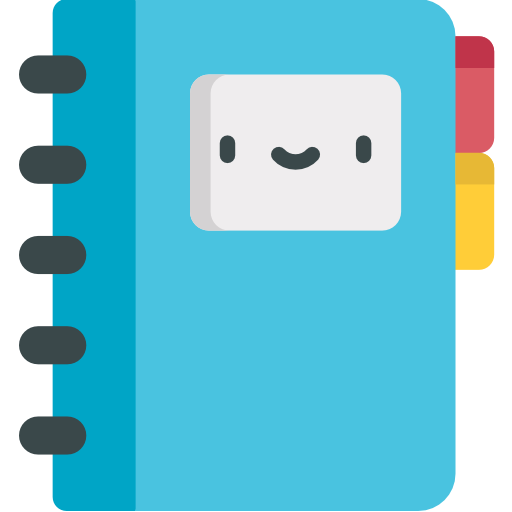

# Track It 📅

</br>

<p align="center">
  
</p>

</br>

## About ❔

<p align="center">Track It is a routine app! Commit into your habits, create new ones, and check the days you've completed or not all your planned habits!</p>

<!-- ## Preview

um gif da aplicação bem maneiro -->

</br>

## Deployment 🚀

<p align="center"><a  href="https://track-it-gilt.vercel.app/">linkr-pi.vercel.app/</a></p>

</br>

## Features ✅

- [x] register and log into the website
- [x] see the habits planned for today
- [x] checkmark your habits planned for today
- [x] see all the habits you registered on the app
- [x] create new habits
- [x] delete a habit
- [x] see your historic on the app
- [x] see your planned habits on each day on the calendar

</br>

## How to run 🏃‍♀️💨

```bash
# Clone this repository
$ git clone <https://github.com/bruch0/TrackIt.git>

# Access the project folder cmd/terminal
$ cd TrackIt

# Install the dependencies
$ npm install

# Run the application 
$ npm start

# The server will automatically start at localhost:3000/ on your favorite browser 
```
</br>

## Tech Stack 💾

<br/>

<p align="center">
  
  
  
  
  
  
</p>

</br>

### Contact

<div align="center">
  
  [](mailto:lucas.bruch0@gmail.com)
  [](https://www.linkedin.com/in/lucas-bruch)
  
</div>
